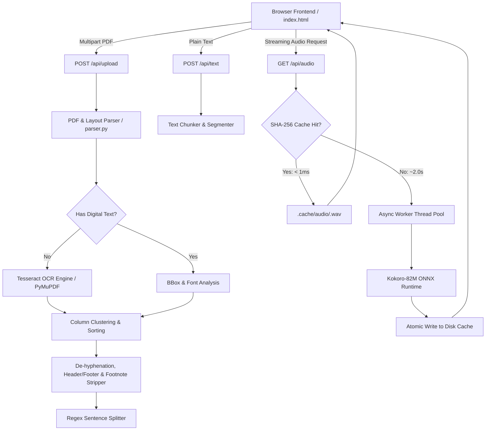

# Architecture & Engineering Deep Dive

**Reader Companion** is engineered for low-latency, private, distraction-free reading with on-device neural Text-to-Speech synthesis. This document covers the internal document processing pipeline, TTS engine integration, caching mechanisms, and concurrency architecture.

---

## High-Level Architecture



---

## 1. Document & Layout Analysis Pipeline (`parser.py`)

Academic papers, book scans, and technical publications frequently utilize multi-column layouts, running headers, and footnotes that disrupt traditional text extractors. Reader Companion implements multi-stage preprocessing:

### Column Clustering & Ordering
- Standard text extraction reads horizontally across the page bounding box, interleaving columns.
- We group text blocks into spatial columns by quantizing horizontal coordinates:
  $$\text{col\_key} = \text{round}\left(\frac{x_0}{200}\right) \times 200$$
- Blocks are then sorted hierarchically by `(col_key, y0)`, ensuring the left column is consumed in its entirety before moving to the right column.

### Artifact & Footnote Filtering
- Spans are introspected for font sizing. Spans with font sizes strictly smaller than $75\%$ of the page median font size are discarded (eliminating superscripts, citation marks, and running notes).
- Stray OCR glitches (isolated punctuation bars `|`, `_`) are filtered.

### Header & Footer Stripping
- Bounding box checks filter out text located within 60 points of the top or bottom margins if character count is below 30.

### De-Hyphenation & Sentence Segmentation
- Hyphenated line wraps (`word-\nbreak`) are merged into unified lexical tokens.
- Text is partitioned into discrete sentences using quote-aware punctuation lookahead regex:
  ```python
  re.split(r'(?<=[.!?])\s+(?=[A-Z0-9"\'“])', text.strip())
  ```

---

## 2. Text-to-Speech Engine (`tts_engine.py`)

The application embeds **Kokoro-82M**, an 82-million parameter diffusion-style neural TTS model exported to ONNX.

### ONNX Runtime CPU Optimization
- Kokoro uses dynamic recurrent tensor graphs. On Apple Silicon, benchmark tests revealed that partitioning into CoreML introduces subgraph transfer overhead (2.59s vs 2.08s).
- We configure `onnxruntime.SessionOptions` specifically for modern multi-core execution:
  - `intra_op_num_threads = 4` (peak throughput avoiding efficiency core thrashing)
  - `inter_op_num_threads = 1`
  - `graph_optimization_level = ORT_ENABLE_ALL`

### Content-Addressed Disk Audio Cache
- Audio clips are addressed by a SHA-256 cryptographic digest of their synthesis tuple:
  $$\text{key} = \text{SHA-256}\left(\text{voice} \mathbin{\Vert} \text{lang} \mathbin{\Vert} \text{text}\right)$$
- Audio is saved in `.cache/audio/<hash>.wav`.
- Identical sentences across any reading session return in **`0.0004s`** with zero CPU utilization.

### Cache Hygiene & Eviction
- `cleanup_cache(max_age_seconds=86400, max_size_mb=250)` automatically prunes clips older than 24 hours and enforces a 250 MB ceiling, purging oldest accessed files first.

---

## 3. Asynchronous Concurrency & Session Isolation (`main.py`)

### Non-Blocking Worker Pool
- TTS inference is compute-intensive and synchronous. Calling it inside FastAPI's async routes without offloading would lock the asyncio event loop.
- `async_generate_audio` delegates execution via `asyncio.to_thread` to a worker threadpool, ensuring the event loop remains responsive for status pings, cancellations, and user interactions.

### Document Session Invalidation
- Each text or PDF submission generates a unique `doc_id` sent in the `X-Doc-Id` response header.
- `/api/audio` requires matching `doc_id` parameters and returns `Cache-Control: no-cache, no-store, must-revalidate`.
- If a user uploads a new document while previous preload requests are in-flight, the server rejects outdated requests with `HTTP 409 Conflict`, avoiding wasted CPU cycles.

---

## 4. Client-Side Read-Along Engine (`static/index.html`)

- **Sentence-Level Spans**: Every sentence is rendered as an interactive `<span>`.
- **Preload Pipeline**: While sentence $N$ plays, the browser automatically requests sentence $N+1$ in the background.
- **Request Cancellation**: When the user jumps to an arbitrary sentence, active preloads are immediately aborted via `AbortController`.
- **Memory Management**: When switching documents or voices, active `blob:` object URLs are revoked via `URL.revokeObjectURL()` to prevent browser memory leaks.
